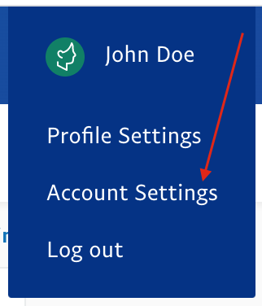
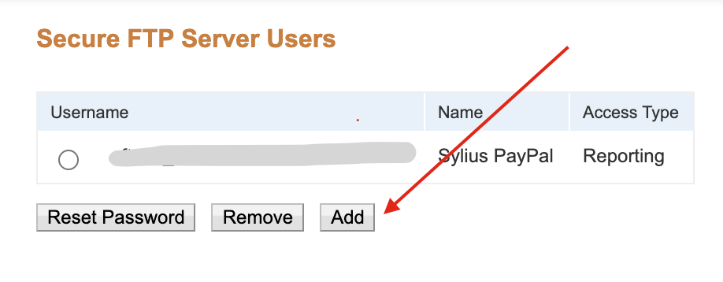

<p align="center">
    <a href="https://sylius.com" target="_blank">
        
    </a>
</p>

<h1 align="center">PayPal Plugin</h1>

## Installation

1. Run

    ```bash
    composer require sylius/paypal-plugin
    ```

2. Import routes

    ```yaml
    # config/routes/sylius_shop.yaml

    sylius_paypal:
        resource: "@SyliusPayPalPlugin/Resources/config/shop_routing.yaml"
        prefix: /{_locale}
        requirements:
            _locale: ^[A-Za-z]{2,4}(_([A-Za-z]{4}|[0-9]{3}))?(_([A-Za-z]{2}|[0-9]{3}))?$

    # config/routes/sylius_admin.yaml

    sylius_paypal_admin:
        resource: "@SyliusPayPalPlugin/Resources/config/admin_routing.yml"
        prefix: /admin

    # config/routes.yaml

    sylius_paypal_webhook:
        resource: "@SyliusPayPalPlugin/Resources/config/webhook_routing.yaml"
    ```

3. Import configuration

   ```yaml
   # config/packages/_sylius.yaml

   imports:
       # ...
       - { resource: "@SyliusPayPalPlugin/Resources/config/config.yaml" }
   ```

3. Override Sylius' templates

    ```bash
    cp -R vendor/sylius/paypal-plugin/src/Resources/views/bundles/* templates/bundles/
    ```

4. Add env variables

    ### Sandbox

    ```
    #.env

    PAYPAL_API_BASE_URL='https://api.sandbox.paypal.com/'
    # just for now, it will be eventually hardcoded (as we always want to use Sylius PayPal facilitator)
    PAYPAL_FACILITATOR_URL='https://paypal.sylius.com'
    PAYPAL_TRACKING_ID='sylius-ppcp4p-bn-code'
    ```

    ### Live

    ```
    #.env

    PAYPAL_API_BASE_URL='https://api.paypal.com/'
    # just for now, it will be eventually hardcoded (as we always want to use Sylius PayPal facilitator)
    PAYPAL_FACILITATOR_URL='https://prod.paypal.sylius.com'
    PAYPAL_TRACKING_ID='sylius-ppcp4p-bn-code'
    ```
   
5. Copy and apply migrations

   ```
   cp -R vendor/sylius/paypal-plugin/migrations/ src/Migrations/
   bin/console doctrine:migrations:migrate -n
   ```

> BEWARE!

To make PayPal integration working, your local Sylius URL should be accessible for the PayPal servers. Therefore you can
add the proper directive to your `/etc/hosts` (something like `127.0.0.1 sylius.local`) or use a service as [ngrok](https://ngrok.com/).

## PayPal reports

To be able to download reports about your payouts, you need to have reports feature enabled on your PayPal account. Also,
it's required to configure SFTP account and set its data in `.env` file.

1. Log in to your PayPal account
2. Enter the profile settings

    

3. Pass to SFTP accounts panel

    

4. Create a new SFTP account

    

5. Configure following env variables

    ```
    PAYPAL_REPORTS_SFTP_HOST='reports.paypal.com'
    PAYPAL_REPORTS_SFTP_USERNAME='USERNAME'
    PAYPAL_REPORTS_SFTP_PASSWORD='PASSWORD'
    ```

## Processing payments

Plugin provides `sylius:pay-pal-plugin:complete-payments` command, that should be configured as cron job on the server.
It iterates over processing PayPal payments and completes them if the order is completed in PayPal.

## Development

```bash
git clone git@github.com:Sylius/PayPalPlugin.git
(cd tests/Application && yarn install)
(cd tests/Application && yarn build)
(cd tests/Application && bin/console assets:install)
(cd tests/Application && bin/console doctrine:database:create)
(cd tests/Application && bin/console doctrine:migrations:migrate -n)
```

### Opening Sylius with your plugin

- Using `test` environment:

    ```bash
    (cd tests/Application && APP_ENV=test bin/console sylius:fixtures:load)
    (cd tests/Application && APP_ENV=test symfony serve)
    ```
    
- Using `dev` environment:

    ```bash
    (cd tests/Application && bin/console sylius:fixtures:load)
    (cd tests/Application && symfony serve)
    ```
