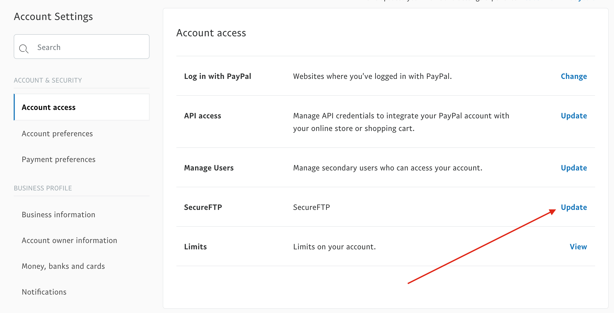

<p align="center">
    <a href="https://sylius.com" target="_blank">
        
    </a>
</p>

<h1 align="center">PayPal Plugin</h1>

## PayPal reports

To be able to download reports about your payouts, you need to have reports feature enabled on your PayPal account. Also,
it's required to configure SFTP account and set its data in `.env` file.

1. Log in to your PayPal account
2. Enter the profile settings

    

3. Pass to SFTP accounts panel

    

4. Create a new SFTP account

    

5. Configure following env variables

    ```
    PAYPAL_REPORTS_SFTP_HOST='reports.paypal.com'
    PAYPAL_REPORTS_SFTP_USERNAME='USERNAME'
    PAYPAL_REPORTS_SFTP_PASSWORD='PASSWORD'
    ```

## Development

```bash
git clone git@github.com:Sylius/PayPalPlugin.git
(cd tests/Application && yarn install)
(cd tests/Application && yarn build)
(cd tests/Application && bin/console assets:install)
(cd tests/Application && bin/console doctrine:database:create)
(cd tests/Application && bin/console doctrine:migrations:migrate -n)
```

### Opening Sylius with your plugin

- Using `test` environment:

    ```bash
    (cd tests/Application && APP_ENV=test bin/console sylius:fixtures:load)
    (cd tests/Application && APP_ENV=test symfony serve)
    ```
    
- Using `dev` environment:

    ```bash
    (cd tests/Application && bin/console sylius:fixtures:load)
    (cd tests/Application && symfony serve)
    ```
